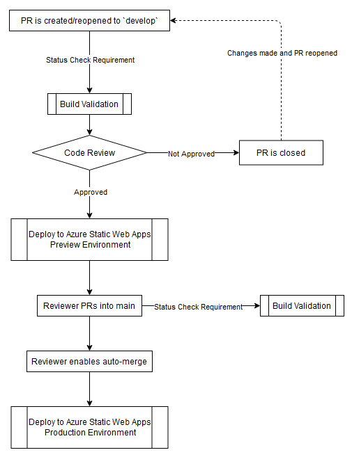

# text-meme-generator

<p align="center"><a href="https://textmemegenerator.com" target="_blank" rel="noopener noreferrer"></a></p>

<h3 align="center">Production Status</h3>
<p align="center">
  <a href="https://github.com/thesftechie/text-meme-generator/actions/workflows/prod-deploy.yml"></a>
  <a href="https://github.com/thesftechie/text-meme-generator/actions/workflows/prod-build.yml"></a>
</p>

<h3 align="center">Preview Status</h3>
<p align="center">
  <a href="https://github.com/thesftechie/text-meme-generator/actions/workflows/preview-deploy.yml"></a>
  <a href="https://github.com/thesftechie/text-meme-generator/actions/workflows/develop-build.yml"></a>
</p>

This project is to allow users to build memes that are formatted like sms/txt messages using default Messages and iMessage layouts. https://textmemegenerator.com

## Contributing

The recommended flow for making contributions is as follows.

1. Fork `develop` branch.
1. Once development for issue/feature is complete, PR into `develop` from your created branch.

## Workflow

The following diagram, additionally described by the steps below the diagram, outlines how changes get deployed.

<div align="center">
<h3>Workflow Diagram</h3>
<div align="center"></div>
</div>

1. A PR is made for an issue/feature branch into `develop`
1. Auto-build validation status check for PR
1. PR is reviewed
   1. PR is closed or comments made to fix.
   1. Changes can be made and the PR reopened if closed after review to start the cycle over.
1. PR is approved
1. Auto-build/deploy to Azure Static Web App preview
   1. Potential fails here if no cleanup on previous previews due to Azure freebie limitations. Contact owner to remove previous previews
1. Reviewer PRs into `main`
1. Auto-build validation check for PR
1. Reviewer enables auto-merge
1. Auto-build/deploy to Azure Static Web App production


<div align="center">
<h3>Celebrate when you're done!</h3>
<div align="center"></div>
</div>

## Recommended IDE Setup

[VSCode](https://code.visualstudio.com/)

## Customize configuration

See [Azure Static Web Apps - staticwebapp.config.json](https://learn.microsoft.com/en-us/azure/static-web-apps/configuration).

## Project Setup

```sh
npm install
```

### Compile and Hot-Reload for Development

```sh
npm run dev
```

### Compile and Minify for Production

```sh
npm run build
```
